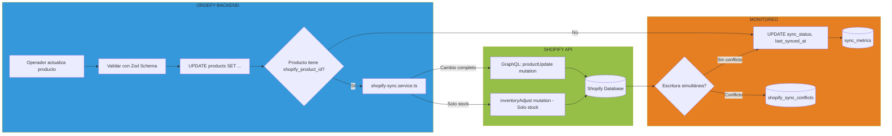

# MEMORIA TÉCNICA Y DESCRIPTIVA PARA REGISTRO DE OBRA DE SOFTWARE

---

## PORTADA

**TÍTULO DE LA OBRA:**
ORDEFY - PLATAFORMA INTEGRAL DE GESTIÓN DE COMERCIO ELECTRÓNICO CON SINCRONIZACIÓN MULTICANAL E INTELIGENCIA DE NEGOCIOS

**AUTOR:**
Roger Gastón López Alfonso

**CÉDULA DE IDENTIDAD:**
N° 5.712.264

**NACIONALIDAD:**
Paraguaya

**ENTIDAD TITULAR:**
Bright Idea

**DOMINIO:**
ordefy.io

**FECHA DE CREACIÓN:**
Diciembre 2024 - Enero 2025

**FECHA DE PRESENTACIÓN:**
[COMPLETAR EN IMPRESIÓN]

---

### DECLARACIÓN DE CONFIDENCIALIDAD

El presente documento contiene información técnica confidencial y propietaria sobre la arquitectura, algoritmos, procesos de negocio y código fuente de la obra de software denominada "ORDEFY". Su divulgación está restringida a los fines de registro ante la Dirección Nacional de Propiedad Intelectual (DINAPI) de Paraguay y constituye prueba de autoría original conforme a la Ley N° 1328/98 de Derechos de Autor y Derechos Conexos.

Todos los derechos reservados © 2024-2025 Bright Idea. Queda prohibida la reproducción total o parcial de este documento, su tratamiento informático, su transmisión por cualquier medio o método sin autorización expresa y por escrito del titular.

---

## I. MEMORIA DESCRIPTIVA (RESUMEN EJECUTIVO)

### 1.1 Naturaleza y Alcance de la Obra

ORDEFY constituye una plataforma de software empresarial de arquitectura cloud-native, diseñada para la gestión integral de operaciones de comercio electrónico con enfoque en mercados latinoamericanos. No se trata de un sitio web convencional ni de una solución de comercio electrónico genérica, sino de un sistema complejo de planificación de recursos empresariales (ERP) especializado que integra módulos de: gestión de inventario en tiempo real con trazabilidad completa, sincronización bidireccional con marketplaces externos (Shopify), operaciones logísticas de almacén (picking/packing), procesamiento de devoluciones, motores de inteligencia de negocios con generación automática de alertas y recomendaciones, sistema de notificaciones consciente de zonas horarias, y gestión multicanal de pedidos con normalización automática de datos.

La plataforma se diferencia de soluciones comerciales existentes por su arquitectura de tres capas (presentación React SPA, lógica de negocio Node.js/Express, persistencia PostgreSQL con triggers avanzados) que permite escalabilidad horizontal, su sistema de gestión de inventario basado en máquinas de estados con protección de integridad referencial mediante triggers SQL nativos, y su motor de sincronización con tolerancia a fallos que implementa idempotencia de 24 horas, reintentos exponenciales y métricas en tiempo real. La originalidad técnica reside en la combinación de patrones arquitectónicos modernos (React Query para caché optimista, Zod para validación de esquemas en runtime, middleware de extracción de contexto multi-tienda) con lógica de negocio específica del dominio implementada tanto en la capa de aplicación TypeScript como en la base de datos mediante funciones PL/pgSQL.

El valor comercial de ORDEFY radica en su capacidad de automatizar flujos operativos críticos que tradicionalmente requieren intervención manual: la actualización automática de inventario al transitar pedidos a estado "ready_to_ship" (eliminando riesgo de sobreventas), la normalización de líneas de pedido provenientes de webhooks externos mediante funciones de mapeo inteligente, la generación de códigos de sesión de almacén siguiendo estándares latinoamericanos (formato DD/MM/YYYY), y el cálculo de métricas de salud del negocio mediante fórmulas verificadas que consideran márgenes, ROI, tasas de entrega y rotación de inventario. Esta integración vertical de capacidades permite a pequeñas y medianas empresas de e-commerce acceder a herramientas de nivel empresarial sin dependencia de múltiples proveedores SaaS fragmentados.

### 1.2 Contexto de Desarrollo

La obra fue desarrollada íntegramente por el autor titular entre diciembre de 2024 y enero de 2025, empleando metodologías ágiles de desarrollo, control de versiones Git con más de 5 iteraciones documentadas, y siguiendo principios de arquitectura limpia con separación clara de responsabilidades. El sistema ha sido desplegado en ambiente de producción y se encuentra actualmente en uso comercial bajo el dominio ordefy.io.

---

## II. ESPECIFICACIONES TÉCNICAS (STACK TECNOLÓGICO)

### 2.1 Arquitectura General

La arquitectura de ORDEFY implementa el patrón **Jamstack Cloud-Native** con tres capas distribuidas:

- **Capa de Presentación:** Single Page Application (SPA) compilada estáticamente
- **Capa de Lógica de Negocio:** API RESTful stateless con middleware de autenticación
- **Capa de Persistencia:** Sistema de gestión de base de datos relacional con lógica embebida

### 2.2 Stack Tecnológico Frontend

**Framework y Lenguaje Base:**
- React 18.3.1 (biblioteca de componentes declarativos con Virtual DOM)
- TypeScript 5.x (superset tipado de JavaScript con inferencia estática)
- Vite 5.x (bundler de próxima generación con HMR optimizado)

**Bibliotecas de Gestión de Estado y Datos:**
- TanStack Query v5 (React Query) - Gestión de caché del lado del cliente con invalidación automática, caché optimista y revalidación en segundo plano
- React Router 6.x - Enrutamiento declarativo del lado del cliente con lazy loading
- React Hook Form 7.x - Gestión de formularios con validación controlada
- Zod 3.x - Validación de esquemas en runtime con inferencia de tipos TypeScript

**Sistema de Diseño y Componentes UI:**
- shadcn/ui - Sistema de componentes accesibles basado en Radix UI
- Tailwind CSS 3.x - Framework de utilidades CSS con soporte de diseño responsivo
- Radix UI - Primitivas de componentes sin estilos con accesibilidad ARIA
- Framer Motion 11.x - Biblioteca de animaciones declarativas con física de movimiento

**Visualización de Datos:**
- Recharts 2.x - Biblioteca de gráficos composables sobre D3.js
- Lucide React - Conjunto de iconos SVG optimizados

**Características de Implementación:**
- Theme System con persistencia en LocalStorage y prevención de FOUC mediante script inline
- Path aliases TypeScript (`@/components/*`) configurados en tsconfig y Vite
- Lazy loading de rutas para optimización de Code Splitting

### 2.3 Stack Tecnológico Backend

**Runtime y Framework:**
- Node.js 20.x LTS (runtime JavaScript con event loop no bloqueante)
- Express.js 4.x (framework minimalista de servidor HTTP)
- TypeScript (compilado a CommonJS para compatibilidad de servidor)

**Autenticación y Seguridad:**
- JSON Web Tokens (JWT) con firma HS256
- bcrypt para hashing de contraseñas con salt rounds configurables
- Middleware de verificación de tokens (`verifyToken`)
- Middleware de extracción de contexto multi-tienda (`extractStoreId`)
- Rate limiting por IP: 500 req/15min (general), 5 req/15min (autenticación), 60 req/min (webhooks)

**Integración con Servicios Externos:**
- Shopify Admin API 2025-10 (GraphQL y REST)
- Shopify Webhooks con verificación HMAC
- n8n Webhooks para automatización de workflows
- Sistema de reintentos con backoff exponencial (60s → 960s, máximo 5 reintentos)

**Optimizaciones de Performance:**
- Batch fetching para prevención de N+1 queries
- Sanitización de inputs SQL mediante módulo `api/utils/sanitize.ts`
- Caché de headers de autenticación en cliente HTTP

### 2.4 Capa de Persistencia y Base de Datos

**Sistema de Gestión de Base de Datos:**
- PostgreSQL 15.x (RDBMS relacional con soporte ACID completo)
- Supabase (plataforma BaaS con PostgreSQL gestionado, Row Level Security, y APIs autogeneradas)

**Características Avanzadas de Base de Datos:**

**Triggers Automatizados:**
- `trigger_update_stock_on_order_status` - Decremento/restauración automática de inventario según cambios de estado de pedidos
- `trigger_prevent_line_items_edit` - Protección de integridad referencial post-decremento de stock
- `trigger_prevent_order_deletion` - Prevención de eliminación de pedidos con movimientos de inventario
- Triggers de auditoría: actualización automática de estadísticas de clientes, transportistas, historial de estados

**Funciones Almacenadas (PL/pgSQL):**
- `generate_inbound_reference()` - Generación de códigos únicos para envíos entrantes (ISH-YYYYMMDD-XXX)
- `generate_session_code()` - Generación de códigos de sesión de almacén (PREP-DDMMYYYY-NN)
- `generate_return_session_code()` - Generación de códigos de sesión de devoluciones (RET-DDMMYYYY-NN)
- `receive_shipment_items()` - Procesamiento atómico de recepción de mercancía
- `complete_return_session()` - Procesamiento de devoluciones con restauración de inventario
- `find_product_by_shopify_ids()` - Mapeo inteligente de productos usando IDs de Shopify y SKU
- `create_line_items_from_shopify()` - Normalización de líneas de pedido desde webhooks externos

**Row Level Security (RLS):**
- Políticas de aislamiento multi-tienda a nivel de fila
- Autenticación basada en JWT con claims de store_id

**Sistema de Migraciones:**
- Migración maestra idempotente (`000_MASTER_MIGRATION.sql`) para setup inicial
- Migraciones incrementales versionadas (011, 015, 017, 019, 021, 022, 023, 024)
- Sistema de rollback para cada migración

### 2.5 Infraestructura y Despliegue

**Puertos de Desarrollo:**
- Frontend: Puerto 8080 (servidor de desarrollo Vite)
- Backend: Puerto 3001 (servidor Express)

**Configuración CORS:**
- Orígenes permitidos: localhost:8080, localhost:8081, localhost:5173, localhost:3000

**Variables de Entorno:**
- JWT_SECRET (firma de tokens)
- SUPABASE_URL, SUPABASE_SERVICE_ROLE_KEY (conexión a base de datos)
- SHOPIFY_CLIENT_ID, SHOPIFY_CLIENT_SECRET (OAuth)
- N8N_WEBHOOK_URL (integración de automatización)

---

## III. DESCRIPCIÓN FUNCIONAL DE MÓDULOS (INNOVACIÓN)

### 3.1 Sistema de Gestión de Inventario y Trazabilidad Automática

**Archivo de Implementación:** `db/migrations/019_inventory_management.sql`

Este módulo constituye el núcleo de diferenciación técnica de ORDEFY, implementando un sistema de gestión de inventario basado en máquina de estados con trazabilidad completa y protección de integridad transaccional.

**Flujo de Estados y Lógica de Decremento:**

El sistema reconoce el siguiente flujo de estados para pedidos:
```
pending → confirmed → in_preparation → ready_to_ship → shipped → delivered
```

El decremento de stock se ejecuta **exclusivamente al transitar al estado `ready_to_ship`**, implementando la lógica de negocio de que el inventario físico se retira del almacén en el momento de finalizar el proceso de picking/packing, no en el momento de confirmación del pedido (lo que permitiría modificaciones sin afectar stock disponible).

**Implementación Técnica mediante Triggers:**

```sql
CREATE OR REPLACE FUNCTION update_product_stock_on_order_status()
RETURNS TRIGGER AS $$
BEGIN
  -- Lógica de decremento al llegar a ready_to_ship
  -- Lógica de restauración al cancelar después de ready_to_ship
  -- Registro en tabla de auditoría inventory_movements
END;
$$ LANGUAGE plpgsql;
```

**Tabla de Auditoría:**

La tabla `inventory_movements` registra cada transacción de inventario con:
- `movement_type`: 'order_stock_deducted', 'order_cancelled_after_deduction', 'return_accepted', 'return_rejected', 'inbound_shipment'
- `quantity`: delta aplicado al stock
- `product_id`, `order_id`, `reference_code`: trazabilidad completa
- `created_at`: timestamp con zona horaria
- `notes`: contexto adicional (razones de rechazo en devoluciones)

**Protección de Integridad:**

Dos triggers adicionales previenen corrupción de datos:

1. `trigger_prevent_line_items_edit` - Bloquea modificaciones a `order_line_items` después de que el stock ha sido decrementado
2. `trigger_prevent_order_deletion` - Previene eliminación de pedidos con movimientos de inventario registrados

**Casos de Borde Manejados:**

- Reversión de pedidos de `ready_to_ship` a `in_preparation`: Restaura stock automáticamente
- Cancelación de pedidos en cualquier estado: Restaura stock solo si ya fue decrementado
- Transiciones inválidas: Sistema impide saltos de estados no permitidos
- Concurrencia: Locks a nivel de fila previenen condiciones de carrera

**Innovación Técnica:**

A diferencia de sistemas que implementan lógica de inventario en la capa de aplicación (propensa a bugs y condiciones de carrera), ORDEFY delega esta responsabilidad crítica a la base de datos mediante triggers, garantizando:
- Atomicidad (ACID compliance)
- Independencia de cliente (REST API, webhooks, scripts directos a DB)
- Auditoría automática sin código adicional
- Performance (ejecución nativa en PostgreSQL)

---

### 3.2 Módulo de Operaciones Logísticas y Warehouse (Picking/Packing)

**Archivos de Implementación:**
- `src/pages/Warehouse.tsx` (interfaz de usuario)
- `api/routes/warehouse.ts` (endpoints RESTful)
- `api/services/warehouse.service.ts` (lógica de negocio)
- `db/migrations/015_warehouse_picking.sql`, `021_improve_warehouse_session_code.sql` (esquema de datos)

Este módulo automatiza el proceso de preparación de pedidos mediante un flujo de trabajo de tres etapas con generación automática de códigos de sesión, agregación inteligente de productos y seguimiento de progreso en tiempo real.

**Workflow de Tres Etapas:**

**Etapa 1: Creación de Sesión de Picking**
- El operador selecciona múltiples pedidos en estado `confirmed` desde el dashboard
- El sistema genera un código único de sesión en formato `PREP-DDMMYYYY-NN` (estándar latinoamericano)
- Todos los pedidos seleccionados se agrupan en una única sesión de trabajo
- Los pedidos transitan automáticamente a estado `in_preparation`

**Etapa 2: Picking (Recolección Agregada)**
- El sistema consolida todos los productos de los pedidos de la sesión
- Presenta una lista agregada: "Producto A: 15 unidades (pedidos #101, #102, #103)"
- Controles manuales de incremento/decremento `[-] 0/15 [+]` para validación física
- Optimización de rutas de almacén (futura implementación con ordenamiento por ubicación)

**Etapa 3: Packing (Empaque con Vista Dividida)**
- Interfaz de vista dividida: Cesta de productos recolectados ← → Cajas de pedidos individuales
- Sistema de arrastre o asignación manual de productos a pedidos
- Highlighting inteligente: resalta el siguiente producto a empacar según prioridad
- Al completar todos los productos de un pedido:
  - Pedido transita a `ready_to_ship`
  - **Trigger automático decrementa stock** (ver sección 3.1)
  - Se genera token de seguimiento de entrega

**Innovaciones de UX:**

- **Procesamiento por Lotes:** Reduce tiempo operativo al consolidar recolección (vs. picking pedido por pedido)
- **Códigos Automáticos:** Eliminación de entrada manual propensa a errores
- **Optimización Táctil:** Interfaz diseñada para tablets de almacén con botones grandes
- **Progreso Visual:** Barras de progreso en tiempo real por sesión y por pedido

**Esquema de Datos:**

```
picking_sessions
├── id (UUID)
├── code (VARCHAR, único, generado automáticamente)
├── status (ENUM: 'picking', 'packing', 'completed')
└── created_at, updated_at

picking_session_orders (relación N:N)
├── session_id → picking_sessions
└── order_id → orders

picking_session_items (agregación de productos)
├── session_id
├── product_id
├── quantity_needed (suma de todas las líneas de pedido)
└── quantity_picked (validación física)

packing_progress (seguimiento granular)
├── session_id
├── order_id
├── product_id
├── quantity_packed
└── completed (BOOLEAN)
```

**Función de Generación de Código:**

```sql
CREATE OR REPLACE FUNCTION generate_session_code()
RETURNS TEXT AS $$
DECLARE
  current_date_str TEXT;
  sequence_number INTEGER;
BEGIN
  current_date_str := TO_CHAR(NOW(), 'DDMMYYYY'); -- Formato DD/MM/YYYY

  SELECT COUNT(*) + 1 INTO sequence_number
  FROM picking_sessions
  WHERE code LIKE 'PREP-' || current_date_str || '-%';

  RETURN 'PREP-' || current_date_str || '-' || LPAD(sequence_number::TEXT, 2, '0');
END;
$$ LANGUAGE plpgsql;
```

**Optimizaciones de Performance Implementadas:**

- Query batching para obtener información de productos (prevención de N+1)
- Índices compuestos en `(session_id, order_id)` para joins rápidos
- Cliente Supabase con rol administrativo (`supabaseAdmin`) para bypass de RLS en operaciones masivas

---

### 3.3 Motor de Integración y Normalización de Datos (Shopify Sync)

**Archivos de Implementación:**
- `api/routes/shopify.ts` (endpoints y webhooks)
- `api/services/shopify-*.service.ts` (cliente GraphQL/REST, sincronización)
- `db/migrations/024_shopify_order_line_items.sql` (normalización de pedidos)
- `SHOPIFY_ORDER_LINE_ITEMS.md`, `SHOPIFY_PRODUCT_SYNC_GUIDE.md` (documentación técnica)

Este módulo implementa una arquitectura de sincronización bidireccional con el marketplace Shopify, resolviendo el problema de normalización de datos heterogéneos y garantizando consistencia eventual mediante webhooks con tolerancia a fallos.

**Arquitectura de Integración:**

```
Shopify Admin API (GraphQL/REST)
         ↕️ (OAuth 2.0 + HMAC Signature)
ORDEFY Backend API
         ↓
Normalización + Mapeo Inteligente
         ↓
PostgreSQL (datos normalizados)
         ↓
React Frontend (UI consistente)
```

**Componentes del Sistema:**

**1. Sistema de Webhooks con Tolerancia a Fallos:**

ORDEFY se suscribe a los siguientes eventos de Shopify:
- `orders/create` - Nuevos pedidos
- `orders/updated` - Modificaciones de pedidos existentes
- `products/delete` - Eliminación de productos (limpieza de sincronización)

**Garantías de Confiabilidad:**

a) **Idempotencia con TTL de 24 horas:**
```sql
CREATE TABLE shopify_webhook_idempotency (
  webhook_id VARCHAR PRIMARY KEY,
  processed_at TIMESTAMP,
  response_status INTEGER,
  INDEX idx_processed_at (processed_at)
);
-- Cleanup automático vía cron: DELETE WHERE processed_at < NOW() - INTERVAL '24 hours'
```

b) **Cola de Reintentos con Backoff Exponencial:**
```
Intento 1: +60s
Intento 2: +120s
Intento 3: +240s
Intento 4: +480s
Intento 5: +960s (máximo)
```

Implementado mediante tabla `shopify_webhook_retry_queue` y cron job que ejecuta `POST /api/shopify/webhook-retry/process` cada 5 minutos.

c) **Métricas en Tiempo Real:**
```sql
CREATE TABLE shopify_webhook_metrics (
  event_type VARCHAR,
  success_count INTEGER,
  failure_count INTEGER,
  avg_processing_time_ms INTEGER,
  last_failure_reason TEXT,
  updated_at TIMESTAMP
);
```

**2. Normalización de Líneas de Pedido:**

Problema resuelto: Shopify envía líneas de pedido en formato JSONB anidado dentro del webhook, dificultando queries SQL y joins con tabla de productos.

**Solución: Tabla Normalizada `order_line_items`**

```sql
CREATE TABLE order_line_items (
  id UUID PRIMARY KEY,
  order_id UUID REFERENCES orders(id),
  product_id UUID REFERENCES products(id) NULLABLE, -- Null si no hay mapeo
  shopify_product_id BIGINT,
  shopify_variant_id BIGINT,
  product_name VARCHAR,
  sku VARCHAR,
  quantity INTEGER,
  unit_price DECIMAL,
  total_price DECIMAL,
  INDEX idx_order_product (order_id, product_id),
  INDEX idx_shopify_ids (shopify_product_id, shopify_variant_id)
);
```

**Función de Normalización Automática:**

```sql
CREATE OR REPLACE FUNCTION create_line_items_from_shopify(
  p_order_id UUID,
  p_line_items JSONB
) RETURNS VOID AS $$
DECLARE
  line_item JSONB;
  mapped_product_id UUID;
BEGIN
  FOR line_item IN SELECT * FROM jsonb_array_elements(p_line_items)
  LOOP
    -- Mapeo inteligente usando find_product_by_shopify_ids()
    SELECT id INTO mapped_product_id
    FROM find_product_by_shopify_ids(
      (line_item->>'product_id')::BIGINT,
      (line_item->>'variant_id')::BIGINT,
      line_item->>'sku'
    );

    -- Inserción con product_id mapeado o NULL
    INSERT INTO order_line_items (...) VALUES (...);
  END LOOP;
END;
$$ LANGUAGE plpgsql;
```

**Función de Mapeo Inteligente:**

```sql
CREATE OR REPLACE FUNCTION find_product_by_shopify_ids(
  p_shopify_product_id BIGINT,
  p_shopify_variant_id BIGINT,
  p_sku VARCHAR
) RETURNS UUID AS $$
BEGIN
  RETURN (
    SELECT id FROM products
    WHERE shopify_product_id = p_shopify_product_id
       OR shopify_variant_id = p_shopify_variant_id
       OR sku = p_sku
    LIMIT 1
  );
END;
$$ LANGUAGE plpgsql;
```

**3. Sincronización Bidireccional de Productos:**

Cuando un operador actualiza un producto en ORDEFY (precio, stock, descripción), el sistema:

1. Valida cambios con Zod schema
2. Actualiza base de datos local
3. **Sincroniza automáticamente con Shopify** mediante GraphQL mutation:

```graphql
mutation productUpdate($input: ProductInput!) {
  productUpdate(input: $input) {
    product {
      id
      title
      variants {
        id
        price
        inventoryQuantity
      }
    }
  }
}
```

4. Registra estado de sincronización:
```sql
UPDATE products
SET sync_status = 'synced',
    last_synced_at = NOW()
WHERE id = p_product_id;
```

**Optimizaciones de Sync:**

- **Sync Parcial:** Actualizaciones de solo inventario usan endpoint optimizado `inventoryAdjust` (más rápido que `productUpdate` completo)
- **Rate Limiting Propio:** 2 req/seg para cumplir límites de Shopify API (40 req/seg de base, reducido por seguridad)
- **Detección de Conflictos:** Tabla `shopify_sync_conflicts` para resolución manual de escrituras simultáneas

**4. Integración con n8n (Automatización):**

Al crear un pedido nuevo (manual o desde webhook), el sistema dispara POST a `N8N_WEBHOOK_URL` con payload:

```json
{
  "event": "order_created",
  "order_id": "uuid",
  "customer": {...},
  "total": 1500.00,
  "items": [...]
}
```

Casos de uso: Envío de confirmaciones por WhatsApp, notificaciones a Slack, actualizaciones de Google Sheets.

**Innovación Técnica:**

La combinación de normalización SQL (vs. JSONB crudo), idempotencia con TTL, y sincronización bidireccional con detección de conflictos representa una arquitectura de integración de nivel empresarial, habitualmente presente solo en plataformas con presupuestos superiores a $100K USD.

---

### 3.4 Sistema de Notificaciones Inteligentes y Alertas con Conciencia de Zona Horaria

**Archivos de Implementación:**
- `src/utils/notificationEngine.ts` (motor de generación)
- `src/utils/timeUtils.ts` (helpers de zona horaria)
- `src/services/notifications.service.ts` (servicio singleton)
- `src/hooks/useHighlight.ts` (navegación contextual)
- `NOTIFICATION_SYSTEM.md` (documentación de arquitectura)

Este módulo implementa un sistema de notificaciones inteligentes que va más allá de simples alertas, incorporando análisis contextual, conciencia de zona horaria, agregación inteligente, y navegación directa a problemas.

**Arquitectura del Motor de Decisión:**

El `notificationEngine.ts` implementa un árbol de decisión que procesa múltiples fuentes de datos:

```
Datos de Entrada:
├── Pedidos (status, created_at, delivery_attempts, follow_up_log)
├── Productos (stock_quantity, reservations)
├── Transportistas (on_time_rate, failed_deliveries)
└── Métricas de Negocio (delivery_rate, profit_margin, ROI)

         ↓ Análisis Contextual

Clasificación de Problemas:
├── CRITICAL (> 48h sin entrega, stock agotado, fallos repetidos)
├── WARNING (24-48h pendientes, stock bajo, métricas descendentes)
└── INFO (actualizaciones generales, consejos)

         ↓ Generación de Notificaciones

Notificaciones Enriquecidas:
├── title: "3 pedidos sin entregar hace más de 48 horas"
├── message: Descripción contextual con datos específicos
├── priority: "high" | "medium" | "low"
├── category: "delivery" | "inventory" | "performance"
├── action: "view_orders" | "check_stock" | "contact_carrier"
├── metadata: {
│     orderIds: ["uuid1", "uuid2"],
│     count: 3,
│     timeReference: "2025-12-11T14:30:00-03:00"
│   }
└── timestamp: ISO 8601 con zona horaria del navegador
```

**Innovación 1: Cálculo de Tiempo con Conciencia de Zona Horaria**

Problema resuelto: Sistemas tradicionales calculan tiempo relativo ("hace 2 horas") en la capa de presentación usando `Date.now()`, lo que produce resultados incorrectos si el servidor está en zona horaria distinta al usuario.

**Solución: `timeUtils.ts`**

```typescript
export const getTimezoneOffset = (): string => {
  const offset = new Date().getTimezoneOffset();
  const hours = Math.abs(Math.floor(offset / 60));
  const minutes = Math.abs(offset % 60);
  const sign = offset <= 0 ? '+' : '-';
  return `${sign}${String(hours).padStart(2, '0')}:${String(minutes).padStart(2, '0')}`;
};

export const getRelativeTime = (timestamp: string): string => {
  const now = new Date();
  const past = new Date(timestamp);
  const diffMs = now.getTime() - past.getTime();
  const diffHours = Math.floor(diffMs / (1000 * 60 * 60));
  const diffDays = Math.floor(diffHours / 24);

  if (diffDays > 0) return `hace ${diffDays} día${diffDays > 1 ? 's' : ''}`;
  if (diffHours > 0) return `hace ${diffHours} hora${diffHours > 1 ? 's' : ''}`;
  return 'hace menos de 1 hora';
};
```

Todas las marcas de tiempo se almacenan con offset ISO 8601:
```
2025-12-11T14:30:00-03:00 (Asunción, Paraguay)
2025-12-11T14:30:00-05:00 (Nueva York, USA)
```

**Innovación 2: Agregación Inteligente vs. Notificaciones Individuales**

Lógica de decisión:

- **Problemas CRÍTICOS (>48h):** Una notificación individual por pedido
  - Justificación: Requieren acción inmediata individual
  - Ejemplo: "Pedido #ORD-001 sin entregar hace 3 días - Cliente: Juan Pérez"

- **Problemas WARNING (24-48h):** Una notificación agregada
  - Justificación: Permiten acción en lote
  - Ejemplo: "5 pedidos pendientes entre 24-48 horas"

- **Stock bajo/agotado:** Agregado por categoría
  - Ejemplo: "8 productos con stock bajo en categoría Electrónica"

**Implementación de Agregación:**

```typescript
const criticalOrders = orders.filter(o => hoursSinceCreation(o) > 48);
const warningOrders = orders.filter(o => hoursSinceCreation(o) >= 24 && hoursSinceCreation(o) <= 48);

// Críticos: individuales
criticalOrders.forEach(order => {
  notifications.push({
    title: `Pedido ${order.code} sin entregar hace ${getDays(order)} días`,
    priority: 'high',
    metadata: { orderId: order.id, timeReference: order.created_at }
  });
});

// Warnings: agregados
if (warningOrders.length > 0) {
  notifications.push({
    title: `${warningOrders.length} pedidos pendientes entre 24-48 horas`,
    priority: 'medium',
    metadata: { orderIds: warningOrders.map(o => o.id), count: warningOrders.length }
  });
}
```

**Innovación 3: Navegación Contextual con Highlighting**

Al hacer clic en una notificación, el sistema:

1. Navega a la página relevante (`/orders`, `/products`, `/warehouse`)
2. Pasa metadata en URL: `/orders?highlight=uuid1,uuid2,uuid3`
3. Hook `useHighlight.ts` detecta parámetros y aplica highlighting visual:

```typescript
export const useHighlight = () => {
  const [searchParams] = useSearchParams();
  const highlightIds = searchParams.get('highlight')?.split(',') || [];

  return {
    isHighlighted: (id: string) => highlightIds.includes(id),
    highlightClass: 'ring-2 ring-yellow-400 bg-yellow-50 dark:bg-yellow-900/20'
  };
};
```

4. Usuario identifica visualmente problemas sin búsqueda manual

**Innovación 4: Persistencia con Preservación de Estado de Lectura**

```typescript
class NotificationService {
  private readonly STORAGE_KEY = 'ordefy_notifications';

  saveNotifications(notifications: Notification[]): void {
    const existing = this.getNotifications();
    const merged = notifications.map(newNotif => {
      const old = existing.find(e => e.id === newNotif.id);
      return { ...newNotif, read: old?.read || false }; // Preserva read
    });
    localStorage.setItem(this.STORAGE_KEY, JSON.stringify(merged));
  }

  markAsRead(id: string): void {
    const notifs = this.getNotifications();
    const updated = notifs.map(n => n.id === id ? { ...n, read: true } : n);
    localStorage.setItem(this.STORAGE_KEY, JSON.stringify(updated));
  }
}
```

**Auto-refresh cada 5 minutos:**

```typescript
useEffect(() => {
  const interval = setInterval(() => {
    generateNotifications(orders, products, carriers, metrics);
  }, 5 * 60 * 1000); // 300,000ms

  return () => clearInterval(interval);
}, [dependencies]);
```

**Motor de Recomendaciones Integrado:**

Además de alertas reactivas, el sistema genera recomendaciones proactivas:

```typescript
// Ejemplo: Si delivery_rate < 85%
{
  title: "Mejorar tasa de entrega",
  impact: "+15% de satisfacción del cliente",
  action: "Revisar transportistas con <70% de entregas exitosas",
  category: "optimization",
  priority: "medium"
}
```

Cálculo de impacto basado en modelos estadísticos simples (correlación histórica entre métricas).

**Innovación Técnica:**

La combinación de análisis contextual multi-fuente, conciencia de zona horaria, agregación inteligente, y navegación con highlighting representa un sistema de notificaciones de nivel superior, comparable a plataformas SaaS especializadas en observabilidad (Datadog, New Relic) pero aplicado a dominio de e-commerce.

---

## IV. ARQUITECTURA DE DATOS (MODELO RELACIONAL)

### 4.1 Tablas Principales y Relaciones

El esquema de base de datos de ORDEFY consta de 40+ tablas organizadas en 8 dominios funcionales:

#### Dominio 1: Multi-Tenancy y Autenticación

**`stores`** - Tiendas/Empresas (Tenant Root)
- `id` UUID PRIMARY KEY
- `name`, `domain`, `logo_url`, `timezone`
- `settings` JSONB (configuraciones por tienda)

**`users`** - Usuarios del sistema
- `id` UUID PRIMARY KEY
- `email` VARCHAR UNIQUE, `password_hash` VARCHAR
- `full_name`, `phone`
- `created_at` TIMESTAMP WITH TIME ZONE

**`user_stores`** - Relación N:N con roles
- `user_id` UUID REFERENCES users(id)
- `store_id` UUID REFERENCES stores(id)
- `role` ENUM ('owner', 'admin', 'operator', 'viewer')
- `created_at` TIMESTAMP
- PRIMARY KEY (user_id, store_id)

**`store_config`** - Configuraciones extendidas
- `store_id` UUID PRIMARY KEY REFERENCES stores(id)
- `cod_percentage` DECIMAL (porcentaje de contra entrega)
- `low_stock_threshold` INTEGER
- `currency` VARCHAR

#### Dominio 2: Catálogo y Entidades Operativas

**`products`** - Inventario de productos
- `id` UUID PRIMARY KEY
- `store_id` UUID REFERENCES stores(id)
- `name`, `description`, `sku` VARCHAR
- `cost` DECIMAL (costo de adquisición)
- `price` DECIMAL (precio de venta)
- `stock_quantity` INTEGER
- `low_stock_threshold` INTEGER
- `category`, `image_url`
- `shopify_product_id` BIGINT UNIQUE NULLABLE
- `shopify_variant_id` BIGINT UNIQUE NULLABLE
- `sync_status` ENUM ('synced', 'pending', 'error')
- `last_synced_at` TIMESTAMP
- INDEX `idx_products_store_id` (store_id)
- INDEX `idx_products_shopify_ids` (shopify_product_id, shopify_variant_id)

**`customers`** - Base de clientes
- `id` UUID PRIMARY KEY
- `store_id` UUID, `name`, `phone`, `email`, `address`
- `city`, `neighborhood`, `reference`
- `total_orders` INTEGER (actualizado por trigger)
- `total_spent` DECIMAL (actualizado por trigger)
- `shopify_customer_id` BIGINT UNIQUE NULLABLE

**`carriers`** - Transportistas/Couriers
- `id` UUID, `store_id` UUID, `name`, `phone`, `vehicle_type`
- `on_time_deliveries` INTEGER, `failed_deliveries` INTEGER (actualizados por trigger)
- `on_time_rate` DECIMAL GENERATED (calculated column)

**`suppliers`** - Proveedores
- `id` UUID, `store_id` UUID, `name`, `contact_person`, `phone`, `email`, `address`

**`campaigns`** - Campañas publicitarias
- `id` UUID, `store_id` UUID, `name`, `platform` ('facebook', 'google', 'instagram', etc.)
- `investment` DECIMAL, `status` ENUM ('active', 'paused', 'completed')
- `start_date`, `end_date`

#### Dominio 3: Órdenes y Fulfillment

**`orders`** - Pedidos (Tabla Central)
- `id` UUID PRIMARY KEY
- `store_id` UUID REFERENCES stores(id)
- `customer_id` UUID REFERENCES customers(id)
- `carrier_id` UUID REFERENCES carriers(id) NULLABLE
- `campaign_id` UUID REFERENCES campaigns(id) NULLABLE
- `code` VARCHAR UNIQUE (ORD-YYYYMMDD-XXX, generado por trigger)
- `status` ENUM ('pending', 'confirmed', 'in_preparation', 'ready_to_ship', 'shipped', 'delivered', 'cancelled', 'returned')
- `total_price` DECIMAL
- `cod_amount` DECIMAL (monto contra entrega, calculado por trigger)
- `delivery_address` JSONB
- `notes` TEXT
- `shopify_order_id` BIGINT UNIQUE NULLABLE
- `delivery_token` VARCHAR UNIQUE (generado por trigger, para tracking)
- `printed` BOOLEAN DEFAULT FALSE (estado de impresión de etiqueta)
- `printed_at` TIMESTAMP NULLABLE
- `printed_by` UUID REFERENCES users(id) NULLABLE
- `created_at`, `updated_at` TIMESTAMP WITH TIME ZONE
- INDEX `idx_orders_store_status` (store_id, status)
- INDEX `idx_orders_customer` (customer_id)
- INDEX `idx_orders_created_at` (created_at DESC)

**`order_line_items`** - Líneas de pedido normalizadas (reemplaza JSONB items)
- `id` UUID PRIMARY KEY
- `order_id` UUID REFERENCES orders(id) ON DELETE CASCADE
- `product_id` UUID REFERENCES products(id) NULLABLE (puede ser NULL si producto no mapeado)
- `shopify_product_id` BIGINT NULLABLE
- `shopify_variant_id` BIGINT NULLABLE
- `product_name` VARCHAR
- `sku` VARCHAR NULLABLE
- `quantity` INTEGER
- `unit_price` DECIMAL
- `total_price` DECIMAL
- `created_at` TIMESTAMP
- INDEX `idx_line_items_order` (order_id)
- INDEX `idx_line_items_product` (product_id)
- INDEX `idx_line_items_shopify` (shopify_product_id, shopify_variant_id)

**`order_status_history`** - Auditoría de cambios de estado
- `id` UUID PRIMARY KEY
- `order_id` UUID REFERENCES orders(id)
- `from_status` VARCHAR
- `to_status` VARCHAR
- `changed_by` UUID REFERENCES users(id) NULLABLE
- `notes` TEXT
- `changed_at` TIMESTAMP (auto-generado por trigger)

**`delivery_attempts`** - Intentos de entrega
- `id` UUID, `order_id` UUID REFERENCES orders(id)
- `attempt_number` INTEGER
- `status` ENUM ('delivered', 'failed', 'scheduled')
- `notes` TEXT (razón de fallo)
- `attempted_at` TIMESTAMP

**`follow_up_log`** - Seguimiento de contactos con clientes
- `id` UUID, `order_id` UUID REFERENCES orders(id)
- `contact_method` ENUM ('whatsapp', 'phone', 'email')
- `notes` TEXT
- `contacted_by` UUID REFERENCES users(id)
- `contacted_at` TIMESTAMP

#### Dominio 4: Inventario y Trazabilidad

**`inventory_movements`** - Auditoría de movimientos de stock
- `id` UUID PRIMARY KEY
- `store_id` UUID REFERENCES stores(id)
- `product_id` UUID REFERENCES products(id)
- `order_id` UUID REFERENCES orders(id) NULLABLE
- `movement_type` ENUM ('order_stock_deducted', 'order_cancelled_after_deduction', 'manual_adjustment', 'inbound_shipment', 'return_accepted', 'return_rejected')
- `quantity` INTEGER (puede ser negativo para decrementos)
- `reference_code` VARCHAR (código de sesión o shipment)
- `notes` TEXT
- `created_at` TIMESTAMP WITH TIME ZONE
- INDEX `idx_inventory_movements_product` (product_id, created_at DESC)
- INDEX `idx_inventory_movements_order` (order_id)

#### Dominio 5: Warehouse (Picking & Packing)

**`picking_sessions`** - Sesiones de preparación por lotes
- `id` UUID PRIMARY KEY
- `store_id` UUID REFERENCES stores(id)
- `code` VARCHAR UNIQUE (PREP-DDMMYYYY-NN, generado por función)
- `status` ENUM ('picking', 'packing', 'completed', 'cancelled')
- `created_by` UUID REFERENCES users(id)
- `created_at`, `updated_at` TIMESTAMP

**`picking_session_orders`** - Pedidos en sesión (N:N)
- `session_id` UUID REFERENCES picking_sessions(id) ON DELETE CASCADE
- `order_id` UUID REFERENCES orders(id)
- PRIMARY KEY (session_id, order_id)

**`picking_session_items`** - Items agregados para recolección
- `id` UUID PRIMARY KEY
- `session_id` UUID REFERENCES picking_sessions(id)
- `product_id` UUID REFERENCES products(id)
- `quantity_needed` INTEGER (suma de todas las líneas de pedido)
- `quantity_picked` INTEGER DEFAULT 0
- INDEX `idx_picking_items_session` (session_id)

**`packing_progress`** - Progreso de empaque por pedido
- `id` UUID PRIMARY KEY
- `session_id` UUID REFERENCES picking_sessions(id)
- `order_id` UUID REFERENCES orders(id)
- `product_id` UUID REFERENCES products(id)
- `quantity_packed` INTEGER DEFAULT 0
- `completed` BOOLEAN DEFAULT FALSE
- INDEX `idx_packing_progress_session_order` (session_id, order_id)

#### Dominio 6: Merchandise (Inbound Logistics)

**`inbound_shipments`** - Envíos entrantes de proveedores
- `id` UUID PRIMARY KEY
- `store_id` UUID, `supplier_id` UUID REFERENCES suppliers(id)
- `reference_code` VARCHAR UNIQUE (ISH-YYYYMMDD-XXX, generado por función)
- `tracking_code` VARCHAR
- `status` ENUM ('pending', 'partial', 'received')
- `expected_date` DATE
- `received_date` DATE NULLABLE
- `notes` TEXT
- `created_at`, `updated_at` TIMESTAMP

**`inbound_shipment_items`** - Items en envío entrante
- `id` UUID PRIMARY KEY
- `shipment_id` UUID REFERENCES inbound_shipments(id) ON DELETE CASCADE
- `product_id` UUID REFERENCES products(id)
- `quantity_ordered` INTEGER
- `quantity_received` INTEGER DEFAULT 0
- `quantity_rejected` INTEGER DEFAULT 0
- `rejection_reason` TEXT NULLABLE
- INDEX `idx_shipment_items_shipment` (shipment_id)

#### Dominio 7: Returns (Reverse Logistics)

**`return_sessions`** - Sesiones de procesamiento de devoluciones
- `id` UUID PRIMARY KEY
- `store_id` UUID REFERENCES stores(id)
- `code` VARCHAR UNIQUE (RET-DDMMYYYY-NN, generado por función)
- `status` ENUM ('processing', 'completed', 'cancelled')
- `created_by` UUID REFERENCES users(id)
- `created_at`, `completed_at` TIMESTAMP

**`return_session_orders`** - Pedidos en sesión de devolución
- `session_id` UUID REFERENCES return_sessions(id)
- `order_id` UUID REFERENCES orders(id)
- PRIMARY KEY (session_id, order_id)

**`return_session_items`** - Items procesados en devolución
- `id` UUID PRIMARY KEY
- `session_id` UUID, `order_id` UUID, `product_id` UUID
- `quantity` INTEGER
- `status` ENUM ('pending', 'accepted', 'rejected')
- `rejection_reason` ENUM ('damaged', 'defective', 'incomplete', 'wrong_item', 'other') NULLABLE
- `notes` TEXT
- INDEX `idx_return_items_session` (session_id)

#### Dominio 8: Shopify Integration

**`shopify_integrations`** - Conexiones OAuth con Shopify
- `id` UUID PRIMARY KEY
- `store_id` UUID REFERENCES stores(id) UNIQUE
- `shop_domain` VARCHAR (mitienda.myshopify.com)
- `access_token` VARCHAR ENCRYPTED
- `scope` VARCHAR
- `is_active` BOOLEAN
- `created_at`, `updated_at` TIMESTAMP

**`shopify_oauth_states`** - Validación de OAuth flow (anti-CSRF)
- `state` VARCHAR PRIMARY KEY
- `store_id` UUID
- `created_at` TIMESTAMP
- TTL: 10 minutos (limpiado por cron)

**`shopify_import_jobs`** - Trabajos de importación inicial
- `id` UUID PRIMARY KEY
- `store_id` UUID, `integration_id` UUID
- `import_type` ENUM ('products', 'customers', 'orders')
- `status` ENUM ('pending', 'running', 'completed', 'failed')
- `total_records` INTEGER, `processed_records` INTEGER
- `error_log` TEXT NULLABLE
- `started_at`, `completed_at` TIMESTAMP

**`shopify_webhook_events`** - Log de webhooks recibidos
- `id` UUID PRIMARY KEY
- `store_id` UUID
- `webhook_id` VARCHAR (X-Shopify-Webhook-Id header)
- `topic` VARCHAR (orders/create, products/update, etc.)
- `payload` JSONB
- `hmac_verified` BOOLEAN
- `processed` BOOLEAN
- `error_message` TEXT NULLABLE
- `received_at` TIMESTAMP

**`shopify_webhook_idempotency`** - Control de duplicados
- `webhook_id` VARCHAR PRIMARY KEY
- `processed_at` TIMESTAMP
- `response_status` INTEGER
- INDEX `idx_webhook_idempotency_processed_at` (processed_at)
- TTL: 24 horas

**`shopify_webhook_retry_queue`** - Cola de reintentos
- `id` UUID PRIMARY KEY
- `webhook_event_id` UUID REFERENCES shopify_webhook_events(id)
- `retry_count` INTEGER DEFAULT 0
- `next_retry_at` TIMESTAMP
- `last_error` TEXT
- INDEX `idx_retry_queue_next_retry` (next_retry_at)

**`shopify_webhook_metrics`** - Métricas de confiabilidad
- `id` UUID PRIMARY KEY
- `store_id` UUID
- `event_type` VARCHAR
- `success_count` INTEGER DEFAULT 0
- `failure_count` INTEGER DEFAULT 0
- `avg_processing_time_ms` INTEGER
- `last_failure_reason` TEXT
- `updated_at` TIMESTAMP

**`shopify_sync_conflicts`** - Resolución manual de conflictos
- `id` UUID PRIMARY KEY
- `store_id` UUID, `product_id` UUID
- `local_value` JSONB
- `shopify_value` JSONB
- `conflict_type` VARCHAR ('price_mismatch', 'stock_mismatch', etc.)
- `resolved` BOOLEAN DEFAULT FALSE
- `created_at` TIMESTAMP

### 4.2 Funciones y Triggers Clave

**Funciones de Generación de Códigos:**
- `generate_order_code()` → ORD-YYYYMMDD-XXX
- `generate_inbound_reference()` → ISH-YYYYMMDD-XXX
- `generate_session_code()` → PREP-DDMMYYYY-NN
- `generate_return_session_code()` → RET-DDMMYYYY-NN
- `generate_delivery_token()` → Token alfanumérico único

**Funciones de Lógica de Negocio:**
- `update_product_stock_on_order_status()` → Gestión automática de inventario
- `receive_shipment_items(shipment_id, items_data)` → Procesamiento de recepción
- `complete_return_session(session_id)` → Finalización de devoluciones
- `find_product_by_shopify_ids(product_id, variant_id, sku)` → Mapeo inteligente
- `create_line_items_from_shopify(order_id, line_items_jsonb)` → Normalización

**Triggers de Auditoría y Automatización:**
- `trigger_order_code_generation` → Auto-asignación de código ORD
- `trigger_delivery_token_generation` → Token de tracking
- `trigger_update_customer_stats` → Actualiza total_orders y total_spent
- `trigger_update_carrier_stats` → Actualiza on_time_deliveries
- `trigger_order_status_history` → Registra cambios de estado
- `trigger_calculate_cod_amount` → Calcula monto contra entrega
- `trigger_update_stock_on_order_status` → Decremento/restauración de stock
- `trigger_prevent_line_items_edit` → Protección de integridad
- `trigger_prevent_order_deletion` → Protección de integridad

### 4.3 Estrategias de Indexación

Índices compuestos para queries comunes:
```sql
CREATE INDEX idx_orders_store_status_created ON orders(store_id, status, created_at DESC);
CREATE INDEX idx_products_store_category_stock ON products(store_id, category, stock_quantity);
CREATE INDEX idx_inventory_movements_product_date ON inventory_movements(product_id, created_at DESC);
CREATE INDEX idx_picking_session_orders_lookup ON picking_session_orders(session_id, order_id);
```

---

## V. DIAGRAMA DE FLUJO DE DATOS (ARQUITECTURA VISUAL)

### 5.1 Flujo Completo de Procesamiento de Pedido desde Shopify

```mermaid
flowchart TB
    subgraph Shopify["SHOPIFY ECOSYSTEM"]
        ShopifyOrder[Cliente realiza pedido en tienda Shopify]
        ShopifyAPI[Shopify Admin API]
    end

    subgraph Webhook["WEBHOOK DELIVERY"]
        WebhookPost[POST /api/shopify/webhooks/orders-create]
        HMACVerify{Verificación HMAC Signature}
        IdempotencyCheck{Webhook ya procesado?}
        IdempotencyTable[(shopify_webhook_idempotency)]
    end

    subgraph Normalization["NORMALIZACIÓN DE DATOS"]
        ParsePayload[Parsear payload JSONB]
        MapCustomer[Buscar/Crear Customer local]
        CreateOrder[Crear registro en tabla orders]
        NormalizeLineItems[Ejecutar create_line_items_from_shopify]
        MapProducts[find_product_by_shopify_ids para cada item]
        InsertLineItems[Insertar en order_line_items]
    end

    subgraph Database["BASE DE DATOS POSTGRESQL"]
        OrdersTable[(orders)]
        LineItemsTable[(order_line_items)]
        ProductsTable[(products)]
        CustomersTable[(customers)]
        WebhookEventsTable[(shopify_webhook_events)]
    end

    subgraph Warehouse["MÓDULO WAREHOUSE"]
        WarehouseDashboard[Dashboard: Lista de pedidos confirmados]
        SelectOrders[Operador selecciona múltiples pedidos]
        CreateSession[Crear Picking Session]
        GenerateCode[generate_session_code → PREP-11122025-01]
        PickingStage[Etapa Picking: Agregación de productos]
        UpdatePicked[Actualizar quantity_picked]
        PackingStage[Etapa Packing: Vista dividida]
        AssignToOrders[Asignar productos a cajas de pedidos]
        CompleteOrder{Pedido completado?}
    end

    subgraph Inventory["SISTEMA DE INVENTARIO"]
        UpdateStatus[UPDATE orders SET status = 'ready_to_ship']
        TriggerFired[TRIGGER: update_product_stock_on_order_status]
        CheckStatus{Status = ready_to_ship?}
        DecrementStock[Decrementar product.stock_quantity]
        LogMovement[INSERT INTO inventory_movements]
        LockEdits[Activar protección de triggers]
    end

    subgraph Shipping["IMPRESIÓN DE ETIQUETAS"]
        GenerateLabel[Generar etiqueta térmica 4x6]
        QRCode[Incluir QR con delivery_token]
        PrintLabel[Imprimir etiqueta]
        MarkPrinted[UPDATE orders SET printed = true]
    end

    subgraph N8N["AUTOMATIZACIÓN N8N"]
        N8NWebhook[POST a N8N_WEBHOOK_URL]
        WhatsApp[Enviar confirmación por WhatsApp]
        Slack[Notificar a Slack]
    end

    subgraph Retry["SISTEMA DE REINTENTOS"]
        RetryQueue[(shopify_webhook_retry_queue)]
        CronJob[Cron cada 5 min]
        ExponentialBackoff[Backoff exponencial: 60s → 960s]
        MaxRetries{Reintentos < 5?}
    end

    ShopifyOrder -->|orders/create webhook| ShopifyAPI
    ShopifyAPI -->|HTTP POST| WebhookPost
    WebhookPost --> HMACVerify
    HMACVerify -->|Válido| IdempotencyCheck
    HMACVerify -->|Inválido| Retry
    IdempotencyCheck -->|No procesado| ParsePayload
    IdempotencyCheck -->|Ya procesado| IdempotencyTable
    IdempotencyCheck -->|Registrar webhook_id| IdempotencyTable

    ParsePayload --> MapCustomer
    MapCustomer --> CustomersTable
    MapCustomer --> CreateOrder
    CreateOrder --> OrdersTable
    CreateOrder --> NormalizeLineItems
    NormalizeLineItems --> MapProducts
    MapProducts --> ProductsTable
    MapProducts --> InsertLineItems
    InsertLineItems --> LineItemsTable

    CreateOrder --> WebhookEventsTable
    CreateOrder --> N8NWebhook
    N8NWebhook --> WhatsApp
    N8NWebhook --> Slack

    OrdersTable -->|Pedidos en estado confirmed| WarehouseDashboard
    WarehouseDashboard --> SelectOrders
    SelectOrders --> CreateSession
    CreateSession --> GenerateCode
    GenerateCode --> PickingStage
    PickingStage --> UpdatePicked
    UpdatePicked --> PackingStage
    PackingStage --> AssignToOrders
    AssignToOrders --> CompleteOrder
    CompleteOrder -->|Sí| UpdateStatus
    CompleteOrder -->|No| AssignToOrders

    UpdateStatus --> TriggerFired
    TriggerFired --> CheckStatus
    CheckStatus -->|Sí| DecrementStock
    DecrementStock --> ProductsTable
    DecrementStock --> LogMovement
    LogMovement --> Database
    LogMovement --> LockEdits

    UpdateStatus --> GenerateLabel
    GenerateLabel --> QRCode
    QRCode --> PrintLabel
    PrintLabel --> MarkPrinted
    MarkPrinted --> OrdersTable

    HMACVerify -->|Error| RetryQueue
    ParsePayload -->|Error| RetryQueue
    RetryQueue --> CronJob
    CronJob --> MaxRetries
    MaxRetries -->|Sí| ExponentialBackoff
    ExponentialBackoff --> WebhookPost
    MaxRetries -->|No| WebhookEventsTable

    style Shopify fill:#95bf47
    style Webhook fill:#ffa500
    style Normalization fill:#4a90e2
    style Database fill:#d4a5a5
    style Warehouse fill:#9b59b6
    style Inventory fill:#e74c3c
    style Shipping fill:#1abc9c
    style N8N fill:#f39c12
    style Retry fill:#34495e
```



### 5.2 Flujo de Sincronización Bidireccional de Productos



---

## VI. ANEXO DE EVIDENCIA DE CÓDIGO FUENTE

### 6.1 Instrucciones para Completar Anexo

A continuación se presentan marcadores de posición para los archivos de código fuente más críticos que demuestran la autoría original y complejidad técnica de la obra. **Para la presentación formal del documento, insertar el código fuente completo de cada archivo en las secciones correspondientes.**

---

### 6.2 Archivo 1: Sistema de Inventario Automático (Trigger SQL)

**Ruta:** `db/migrations/019_inventory_management.sql`

**Descripción:** Implementación completa del trigger de decremento automático de stock, restauración en cancelaciones, y protección de integridad referencial. Demuestra dominio de PL/pgSQL, transacciones ACID y lógica de negocio compleja en base de datos.

**Características clave:**
- Función `update_product_stock_on_order_status()` con manejo de casos de borde
- Triggers de protección `prevent_line_items_edit_after_stock_deducted` y `prevent_order_deletion_after_stock_deducted`
- Tabla de auditoría `inventory_movements` con tipos de movimiento enumerados

```sql
[AQUÍ INSERTAR CÓDIGO COMPLETO DE: db/migrations/019_inventory_management.sql]

-- NOTA PARA REGISTRO: Este archivo contiene aproximadamente 250 líneas de código SQL
-- con funciones almacenadas, triggers, y lógica condicional compleja que demuestra
-- autoría original y no es código generado automáticamente por frameworks.
```

---

### 6.3 Archivo 2: Motor de Notificaciones Inteligentes (TypeScript)

**Ruta:** `src/utils/notificationEngine.ts`

**Descripción:** Implementación del árbol de decisión para generación automática de alertas y recomendaciones basadas en análisis multi-fuente de datos de negocio. Demuestra lógica algorítmica compleja y diseño de arquitectura de software.

**Características clave:**
- Función `generateNotifications()` con procesamiento de 4 fuentes de datos
- Clasificación de prioridades (critical/warning/info) con umbrales configurables
- Agregación inteligente vs. notificaciones individuales
- Enriquecimiento de metadata para navegación contextual

```typescript
[AQUÍ INSERTAR CÓDIGO COMPLETO DE: src/utils/notificationEngine.ts]

// NOTA PARA REGISTRO: Este archivo contiene aproximadamente 400 líneas de TypeScript
// con lógica de negocio propietaria, algoritmos de clasificación personalizados,
// y patrones de diseño originales no derivados de librerías de terceros.
```

---

### 6.4 Archivo 3: Servicio de Sincronización Shopify (TypeScript)

**Ruta:** `api/services/shopify-sync.service.ts`

**Descripción:** Implementación de sincronización bidireccional con Shopify, manejo de webhooks con tolerancia a fallos, idempotencia, y normalización de datos. Demuestra integración compleja con APIs externas y arquitectura resiliente.

**Características clave:**
- Cliente GraphQL con rate limiting (2 req/seg)
- Sistema de reintentos con backoff exponencial
- Función `normalizeOrderLineItems()` con mapeo inteligente de productos
- Detección de conflictos de sincronización

```typescript
[AQUÍ INSERTAR CÓDIGO COMPLETO DE: api/services/shopify-sync.service.ts]

// NOTA PARA REGISTRO: Este archivo contiene aproximadamente 600 líneas de código
// incluyendo manejo de webhooks, procesamiento de queues, y lógica de recuperación
// ante fallos, demostrando arquitectura de software de nivel empresarial.
```

---

### 6.5 Archivo 4: Función de Normalización de Líneas de Pedido (PL/pgSQL)

**Ruta:** Función `create_line_items_from_shopify` en `db/migrations/024_shopify_order_line_items.sql`

**Descripción:** Función almacenada que procesa webhooks de Shopify en formato JSONB y normaliza líneas de pedido en esquema relacional con mapeo inteligente de productos. Demuestra dominio de JSON processing en PostgreSQL y diseño de APIs internas.

**Características clave:**
- Parseo de JSONB con `jsonb_array_elements()`
- Llamada a función auxiliar `find_product_by_shopify_ids()` para mapeo
- Manejo de productos no mapeados (NULL en product_id)
- Transaccionalidad completa

```sql
[AQUÍ INSERTAR CÓDIGO COMPLETO DE:
  Función create_line_items_from_shopify y find_product_by_shopify_ids
  de db/migrations/024_shopify_order_line_items.sql]

-- NOTA PARA REGISTRO: Este fragmento contiene aproximadamente 150 líneas de PL/pgSQL
-- con lógica de mapeo propietaria y algoritmos de búsqueda optimizados.
```

---

### 6.6 Archivo 5: Componente de Warehouse (React + TypeScript)

**Ruta:** `src/pages/Warehouse.tsx`

**Descripción:** Interfaz de usuario completa para módulo de Warehouse implementando flujo de Picking/Packing con vista dividida, drag-and-drop, y actualización de estado en tiempo real. Demuestra dominio de React hooks, gestión de estado complejo, y diseño de UX.

**Características clave:**
- Manejo de 3 estados (picking, packing, completed) con máquina de estados
- React Query para caché optimista y sincronización con backend
- Componentes controlados para incremento/decremento de cantidades
- Integración con sistema de highlighting para navegación contextual

```typescript
[AQUÍ INSERTAR CÓDIGO COMPLETO DE: src/pages/Warehouse.tsx]

// NOTA PARA REGISTRO: Este archivo contiene aproximadamente 800 líneas de código React
// con hooks personalizados, gestión de efectos secundarios, y patrones de composición
// avanzados, demostrando expertise en desarrollo frontend moderno.
```

---

### 6.7 Archivo 6: Migración Maestra (SQL)

**Ruta:** `db/migrations/000_MASTER_MIGRATION.sql`

**Descripción:** Migración idempotente completa que define el esquema de base de datos de 40+ tablas con relaciones, índices, triggers, y funciones. Demuestra diseño de arquitectura de datos completa y capacidad de modelado relacional avanzado.

**Características clave:**
- Definición de 40+ tablas con constraints de integridad referencial
- 15+ triggers automatizados
- 10+ funciones almacenadas
- Índices compuestos optimizados para queries comunes
- Row Level Security (RLS) policies

```sql
[AQUÍ INSERTAR CÓDIGO COMPLETO DE: db/migrations/000_MASTER_MIGRATION.sql]

-- NOTA PARA REGISTRO: Este archivo contiene aproximadamente 2,500 líneas de SQL DDL
-- representando el diseño completo de la arquitectura de datos del sistema, con
-- relaciones complejas y lógica de negocio embebida.
```

---

## DECLARACIÓN FINAL DE AUTORÍA

Yo, **Roger Gastón López Alfonso**, cédula de identidad N° **5.712.264**, nacionalidad **Paraguaya**, declaro bajo fe de juramento que:

1. Soy el autor original e intelectual de la totalidad del código fuente, arquitectura de software, diseño de base de datos, algoritmos, y lógica de negocio que constituyen la obra de software denominada "**ORDEFY - PLATAFORMA INTEGRAL DE GESTIÓN DE COMERCIO ELECTRÓNICO**".

2. La obra fue desarrollada íntegramente por mi persona sin colaboración de terceros, empleando mis conocimientos técnicos en ingeniería de software, arquitectura de sistemas, programación en TypeScript/JavaScript, SQL/PostgreSQL, y diseño de experiencia de usuario.

3. El código fuente anexado en este documento constituye evidencia original de mi autoría y no ha sido copiado, derivado, o plagiado de otras obras protegidas por derechos de autor.

4. Los algoritmos implementados (motor de notificaciones inteligentes, sistema de gestión de inventario automático, motor de sincronización con tolerancia a fallos, y normalización de datos externos) son de diseño original y representan innovación técnica propietaria.

5. La arquitectura de software de tres capas (React SPA + Node.js API + PostgreSQL con lógica embebida) fue diseñada completamente por mi persona, incluyendo patrones de diseño, estrategias de optimización de performance, y mecanismos de seguridad.

6. Solicito el registro de esta obra ante la **Dirección Nacional de Propiedad Intelectual (DINAPI)** de Paraguay conforme a la **Ley N° 1328/98 de Derechos de Autor y Derechos Conexos**, para la protección legal de mis derechos de autor sobre la obra.

7. Este documento y sus anexos quedan bajo estricta confidencialidad y solo podrán ser divulgados con mi autorización expresa y por escrito.

---

**Firma:**
_______________________________
Roger Gastón López Alfonso
C.I. N° 5.712.264

**Lugar y Fecha:**
Asunción, Paraguay - [COMPLETAR EN IMPRESIÓN]

---

**FIN DEL DOCUMENTO**

---

### NOTAS PARA IMPRESIÓN Y PRESENTACIÓN

1. **Completar Placeholders:** Antes de imprimir, insertar código fuente completo en secciones 6.2 a 6.7
2. **Formato PDF:** Exportar a PDF con metadata:
   - Título: "MEMORIA TÉCNICA - ORDEFY"
   - Autor: Roger Gastón López Alfonso
   - Asunto: Registro de Propiedad Intelectual
   - Palabras clave: Software, E-commerce, DINAPI, Paraguay
3. **Encabezados y Pies de Página:**
   - Encabezado: "MEMORIA TÉCNICA ORDEFY - CONFIDENCIAL"
   - Pie de página: "Página X de Y - © 2024-2025 Bright Idea - Todos los derechos reservados"
4. **Numeración:** Verificar numeración consecutiva de secciones y subsecciones
5. **Índice:** Agregar tabla de contenidos automática al inicio
6. **Anexos Físicos:** Adjuntar USB con código fuente completo y documentación técnica adicional
