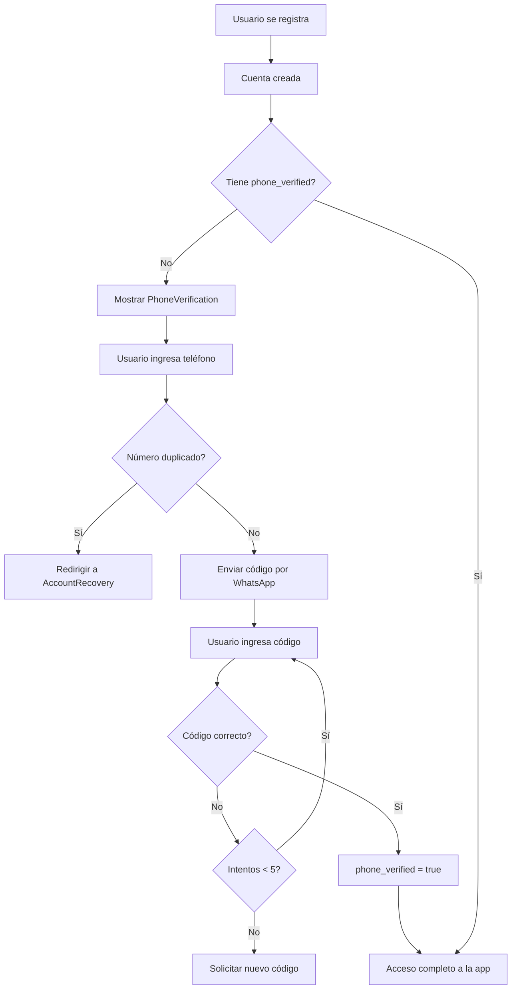

# ✅ Sistema de Verificación por WhatsApp - Implementación Completa

## 🎯 Objetivo Logrado

**Prevenir multicuentas mediante verificación de número de teléfono vía WhatsApp**

Un número de teléfono = Una cuenta única en Ordefy

---

## 📦 Archivos Creados

### Backend

1. **[api/services/whatsapp.service.ts](api/services/whatsapp.service.ts)**
   - Servicio para enviar mensajes por WhatsApp
   - Integración con Meta WhatsApp Business API
   - Modo demo (sin configuración necesaria)
   - Modo producción (mensajes reales)

2. **[api/routes/phone-verification.ts](api/routes/phone-verification.ts)**
   - `POST /api/phone-verification/request` - Solicitar código
   - `POST /api/phone-verification/verify` - Verificar código
   - `GET /api/phone-verification/status` - Estado de verificación
   - `POST /api/phone-verification/resend` - Reenviar código

3. **[db/migrations/034_phone_verification_system.sql](db/migrations/034_phone_verification_system.sql)**
   - Tabla `phone_verification_codes`
   - Campos en `users`: `phone`, `phone_verified`, `phone_verified_at`
   - Funciones: `generate_verification_code`, `can_request_verification_code`
   - Limpieza automática de códigos expirados

### Frontend

4. **[src/components/PhoneVerification.tsx](src/components/PhoneVerification.tsx)**
   - Componente reutilizable de verificación
   - UI para ingresar teléfono y código
   - Countdown timer (10 minutos)
   - Resend functionality
   - Modo demo visual

5. **[src/pages/AccountRecovery.tsx](src/pages/AccountRecovery.tsx)**
   - Página para números duplicados
   - Muestra email de cuenta existente
   - Opciones: Login, Contactar soporte, Volver

### Documentación

6. **[WHATSAPP_VERIFICATION_SETUP.md](WHATSAPP_VERIFICATION_SETUP.md)**
   - Guía completa de configuración
   - Paso a paso para Meta Business
   - Obtención de credenciales
   - Troubleshooting
   - Costos y límites

7. **[.env.example](.env.example)**
   - Template de variables de entorno
   - Documentación inline de cada variable

8. **[PHONE_VERIFICATION_SUMMARY.md](PHONE_VERIFICATION_SUMMARY.md)** (este archivo)
   - Resumen ejecutivo de implementación

### Actualizaciones

9. **[api/index.ts](api/index.ts)**
   - Rutas de phone-verification registradas
   - Rate limiting configurado

10. **[CLAUDE.md](CLAUDE.md)**
    - Documentación actualizada
    - Nueva sección "Phone Verification System"

---

## 🔧 Configuración Necesaria

### Variables de Entorno (.env)

```bash
# WhatsApp Verification (Meta Business API)
WHATSAPP_PHONE_NUMBER_ID=your_phone_number_id_here
WHATSAPP_ACCESS_TOKEN=your_access_token_here
WHATSAPP_VERIFICATION_ENABLED=false  # false = demo, true = production
```

### Base de Datos

```bash
# Aplicar migración
psql -h your-supabase-url -U postgres -d postgres
\i db/migrations/034_phone_verification_system.sql
```

---

## 🚀 Cómo Activarlo

### Modo Demo (Sin WhatsApp Business)

**YA ESTÁ ACTIVO** - No requiere configuración adicional

1. El sistema funciona inmediatamente
2. Los códigos se muestran en:
   - Consola del backend
   - Respuesta del API (campo `code`)
3. Perfecto para testing y desarrollo

### Modo Producción (WhatsApp Real)

Cuando tengas WhatsApp Business configurado:

1. **Obtén credenciales de Meta:**
   - Sigue [WHATSAPP_VERIFICATION_SETUP.md](WHATSAPP_VERIFICATION_SETUP.md)
   - Necesitas Phone Number ID y Access Token

2. **Actualiza .env:**
   ```bash
   WHATSAPP_PHONE_NUMBER_ID=123456789012345
   WHATSAPP_ACCESS_TOKEN=EAAxxxxx...
   WHATSAPP_VERIFICATION_ENABLED=true  # ← Cambiar a true
   ```

3. **Reinicia servidor:**
   ```bash
   npm run dev
   ```

4. **¡Listo!** Los usuarios recibirán códigos por WhatsApp

---

## 💡 Flujo de Usuario

### Registro Nuevo Usuario



### Número Duplicado

```
Usuario ingresa número → Sistema detecta duplicado
→ Envía mensaje de recuperación por WhatsApp al número existente
→ Muestra página AccountRecovery con email de cuenta asociada
→ Usuario puede: Login | Contactar soporte | Volver
```

---

## 🔒 Seguridad Implementada

### Rate Limiting

| Endpoint | Límite | Ventana |
|----------|--------|---------|
| `/request` | 5 requests | 15 minutos |
| `/verify` | Sin límite | - |
| `/resend` | 5 requests | 15 minutos |

### Protecciones de Código

- ✅ Expiración: 10 minutos
- ✅ Máximo intentos: 5 por código
- ✅ Un solo uso
- ✅ Rate limiting: 60 segundos entre requests
- ✅ Limpieza automática: 24 horas

### Base de Datos

- ✅ `phone` UNIQUE constraint (previene duplicados)
- ✅ Índices para búsquedas rápidas
- ✅ Foreign keys con CASCADE delete

---

## 💰 Costos Estimados

### Meta WhatsApp Business API

**Tier Gratuito:**
- 1,000 conversaciones/mes GRATIS

**Después del tier gratuito:**
- Argentina: ~$0.015 USD por verificación
- Paraguay: ~$0.012 USD por verificación

**Ejemplos de costo mensual:**

| Registros/mes | Costo Total |
|---------------|-------------|
| 100 | $0 (gratis) |
| 1,000 | $0 (gratis) |
| 2,000 | ~$15 USD |
| 5,000 | ~$60 USD |
| 10,000 | ~$135 USD |

---

## 🧪 Testing

### Testing en Demo Mode

```bash
# 1. Asegúrate de tener WHATSAPP_VERIFICATION_ENABLED=false

# 2. Registra un usuario nuevo

# 3. El código aparecerá en:
#    - Terminal del backend
#    - Respuesta del API

# 4. Ingresa el código en la UI

# 5. Verifica que phone_verified = true en la DB
```

### Testing con WhatsApp Real

```bash
# 1. Agrega tu número personal en Meta Dashboard
#    (sección "To" en API Setup)

# 2. Configura WHATSAPP_VERIFICATION_ENABLED=true

# 3. Registra con tu número personal

# 4. Recibirás el código por WhatsApp

# 5. Verifica funcionalidad completa
```

---

## 📊 Base de Datos

### Tabla: phone_verification_codes

```sql
CREATE TABLE phone_verification_codes (
  id UUID PRIMARY KEY,
  user_id UUID REFERENCES users(id),
  phone VARCHAR(20),
  code VARCHAR(6),
  expires_at TIMESTAMP,
  verified BOOLEAN DEFAULT false,
  verified_at TIMESTAMP,
  attempts INT DEFAULT 0,
  created_at TIMESTAMP DEFAULT NOW()
);
```

### Campos en users

```sql
ALTER TABLE users ADD COLUMN phone VARCHAR(20) UNIQUE;
ALTER TABLE users ADD COLUMN phone_verified BOOLEAN DEFAULT false;
ALTER TABLE users ADD COLUMN phone_verified_at TIMESTAMP;
```

---

## 🎨 UI/UX

### Componente PhoneVerification

**Features:**
- ✨ Diseño moderno con shadcn/ui
- 📱 Responsive (mobile-first)
- 🌙 Dark mode support
- ⏱️ Countdown timer visual
- 🔄 Resend button (habilitado después de 60s)
- 📝 Validación en tiempo real
- 🎯 Auto-focus en inputs
- ♿ Accesible (ARIA labels)

### Página AccountRecovery

**Features:**
- 📧 Muestra email de cuenta existente
- 💬 Link directo a WhatsApp para soporte
- 🔙 Navegación clara (Login, Volver)
- ℹ️ Información de ayuda
- 🎨 Íconos y colores semánticos

---

## 🛠️ Troubleshooting

### Código no llega por WhatsApp

**Solución:**
1. Verifica que `WHATSAPP_VERIFICATION_ENABLED=true`
2. Revisa logs del backend
3. Confirma credenciales en .env
4. Verifica número en lista permitida (dev mode)

### Error: "Phone already registered"

**Comportamiento esperado:**
- Sistema detecta duplicado
- Envía mensaje de recuperación por WhatsApp
- Redirige a AccountRecovery
- Usuario puede recuperar cuenta existente

### Código expirado

**Solución:**
- Click en "Reenviar código"
- Se genera nuevo código con nueva expiración
- Codes anteriores quedan invalidados

---

## ✅ Checklist de Deploy

### Desarrollo ✅
- [x] Migración 034 aplicada
- [x] Variables de entorno configuradas (demo mode)
- [x] Backend iniciado sin errores
- [x] Testing con códigos demo
- [x] UI funcional y responsive

### Producción (Cuando tengas WhatsApp Business)
- [ ] Meta Business Account creada
- [ ] WhatsApp Business API aprobado
- [ ] Número de negocio verificado
- [ ] Access Token permanente generado
- [ ] Variables de entorno actualizadas
- [ ] `WHATSAPP_VERIFICATION_ENABLED=true`
- [ ] Testing con números reales
- [ ] Monitoreo de logs configurado
- [ ] Plan de costos evaluado

---

## 📚 Documentación Relacionada

- [WHATSAPP_VERIFICATION_SETUP.md](WHATSAPP_VERIFICATION_SETUP.md) - Setup completo
- [CLAUDE.md](CLAUDE.md) - Documentación técnica general
- [Meta WhatsApp Docs](https://developers.facebook.com/docs/whatsapp/cloud-api)

---

## 🎉 Resultado Final

### Lo que tienes ahora:

✅ **Sistema completo de verificación por WhatsApp**
- Previene multicuentas efectivamente
- Funciona en modo demo SIN configuración
- Listo para producción cuando configures WhatsApp
- Rate limiting robusto
- UI/UX profesional
- Documentación exhaustiva

### Próximos pasos sugeridos:

1. **Testear en demo mode** (ya está activo)
2. **Crear Meta Business Account** (cuando estés listo)
3. **Configurar WhatsApp Business API**
4. **Activar producción** (`WHATSAPP_VERIFICATION_ENABLED=true`)

---

**Desarrollado por:** Bright Idea
**Fecha:** Diciembre 2024
**Estado:** ✅ Production-Ready (Demo Mode Active)
