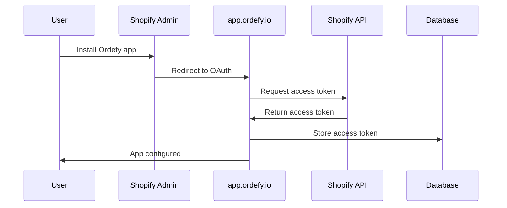

# Shopify Non-Embedded App Setup - Ordefy

## Overview

Ordefy is configured as a **non-embedded Shopify app** hosted on `app.ordefy.io`. This document explains what that means and how it differs from embedded apps.

## Non-Embedded vs Embedded Apps

### Embedded Apps (NOT Ordefy)
- Run inside an iframe within Shopify admin
- Require App Bridge for communication with Shopify admin
- Use session tokens from App Bridge for authentication
- URL pattern: `https://admin.shopify.com/store/{store}/apps/{app}`
- Configuration: `embedded = true` in shopify.app.toml

### Non-Embedded Apps (Ordefy's Configuration)
- Run on a custom domain (app.ordefy.io)
- Open in a new tab/window when launched from Shopify
- Use OAuth access tokens for authentication (NOT session tokens)
- URL pattern: `https://app.ordefy.io`
- Configuration: `embedded = false` in shopify.app.toml

## Current Configuration

```toml
# shopify.app.toml
application_url = "https://app.ordefy.io"
embedded = false
```

## Why App Bridge is NOT Required for Ordefy

The current implementation in `/src/hooks/useShopifyAppBridge.ts` and `/index.html` is **optional** and only works when the app is opened with `?host=xxx&embedded=1` parameters. Since Ordefy is `embedded = false`, App Bridge is NOT necessary for:

1. **Authentication**: Use OAuth access tokens stored in the database (via `/api/shopify/configure`)
2. **API Calls**: Use the Shopify Admin REST/GraphQL API directly with access tokens
3. **Webhooks**: Configured via shopify.app.toml and registered during app installation

### When App Bridge IS Used
- Only if user opens app with `?embedded=1` parameter (rare case)
- For testing embedded context during development
- Not required for production functionality

## Authentication Flow for Non-Embedded Apps

### 1. Installation & OAuth Flow



### 2. API Calls

All API calls use the stored access token:

```typescript
const integration = await getShopifyIntegration(storeId);
const shopifyClient = new ShopifyClientService(integration);
await shopifyClient.getProducts();
```

## Bidirectional Sync Implementation

### Shopify → Ordefy (via Webhooks)

Configured in `shopify.app.toml`:

```toml
[[webhooks.subscriptions]]
topics = ["orders/create"]
uri = "https://api.ordefy.io/api/shopify/webhooks/orders-create"

[[webhooks.subscriptions]]
topics = ["orders/updated"]
uri = "https://api.ordefy.io/api/shopify/webhooks/orders-updated"

[[webhooks.subscriptions]]
topics = ["products/update"]
uri = "https://api.ordefy.io/api/shopify/webhooks/products-update"

[[webhooks.subscriptions]]
topics = ["products/delete"]
uri = "https://api.ordefy.io/api/shopify/webhooks/products-delete"
```

When a product/order is created or updated in Shopify admin, a webhook is sent to Ordefy's API, which updates the local database.

### Ordefy → Shopify (Automatic Sync)

When a product is updated in Ordefy's dashboard:

1. User updates product via Products page
2. Frontend calls `PUT /api/products/:id`
3. Backend updates local database
4. **NEW**: Backend automatically checks for Shopify integration
5. If integration exists and product has `shopify_product_id`, sync to Shopify
6. Backend calls `ShopifyProductSyncService.updateProductInShopify()`
7. Product updated in Shopify via Admin API

**Endpoints with auto-sync:**
- `PUT /api/products/:id` - Update product
- `PATCH /api/products/:id/stock` - Update stock
- `DELETE /api/products/:id?hard_delete=true` - Delete product

## Testing Bidirectional Sync

### 1. Test Shopify → Ordefy (Webhooks)

```bash
# Update a product in Shopify admin
# Check Ordefy database/dashboard - should reflect changes

# Use webhook health endpoint to verify
curl -H "Authorization: Bearer {token}" \
     -H "X-Store-ID: {store_id}" \
     https://api.ordefy.io/api/shopify/webhook-health?hours=24
```

### 2. Test Ordefy → Shopify (Auto-Sync)

```bash
# Update product via Ordefy API
curl -X PUT https://api.ordefy.io/api/products/{product_id} \
  -H "Authorization: Bearer {token}" \
  -H "X-Store-ID: {store_id}" \
  -H "Content-Type: application/json" \
  -d '{
    "name": "Updated Product Name",
    "price": 29.99,
    "stock": 50
  }'

# Check Shopify admin - should reflect changes
# Check response for sync_warning if sync failed
```

## App Bridge Cleanup (Optional)

Since App Bridge is not required for non-embedded apps, you can optionally:

1. **Remove App Bridge script** from `/index.html`:
   ```html
   <!-- Can be removed -->
   <script src="https://cdn.shopify.com/shopifycloud/app-bridge.js"></script>
   ```

2. **Remove hooks and components**:
   - `/src/hooks/useShopifyAppBridge.ts`
   - `/src/components/ShopifyInitializer.tsx`

3. **Simplify authentication**: Remove session token logic from `/src/services/api.client.ts`

**OR** keep them for optional embedded mode support (current implementation handles both).

## Deployment Checklist

- [x] shopify.app.toml configured with `embedded = false`
- [x] application_url set to `https://app.ordefy.io`
- [x] Webhooks registered for orders and products
- [x] OAuth flow implemented via `/api/shopify/configure`
- [x] Access tokens stored in database
- [x] Auto-sync implemented for product updates/deletes
- [x] HMAC verification for webhooks using SHOPIFY_API_SECRET
- [x] Rate limiting configured
- [x] GDPR webhooks implemented

## Environment Variables Required

```bash
# Shopify App Credentials
SHOPIFY_API_SECRET=shpss_xxx  # Used for webhook HMAC verification

# n8n Integration (optional)
N8N_WEBHOOK_URL=https://n8n.ordefy.io/webhook/xxx
N8N_API_KEY=xxx

# Database
DATABASE_URL=postgresql://...

# API Configuration
API_PORT=3001
NODE_ENV=production
```

## FAQ

### Q: Why do I see "App Bridge not detected" in the browser console?

**A:** This is expected for non-embedded apps. App Bridge only loads when `?embedded=1` parameter is present. Your app works fine without it.

### Q: Do I need to implement OAuth installation flow?

**A:** Currently, you manually configure integrations via the `/configure` endpoint. For a production public app, you should implement the full OAuth flow:

1. User clicks "Install App" in Shopify App Store
2. Shopify redirects to `https://app.ordefy.io/auth/shopify/callback`
3. Backend exchanges code for access token
4. Token stored in database
5. Webhooks automatically registered

### Q: How do I test webhooks locally?

**A:** Use ngrok or similar tunneling service:

```bash
ngrok http 3001
# Update shopify.app.toml webhook URIs to ngrok URL
# Run: shopify app deploy
```

### Q: Can I switch to embedded mode later?

**A:** Yes, change `embedded = true` in shopify.app.toml and redeploy. The current App Bridge implementation will automatically activate.

---

**Last Updated:** 2025-01-25
**Developed by:** Bright Idea
**App:** Ordefy
